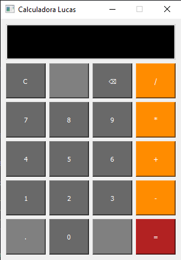
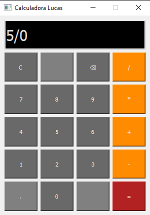
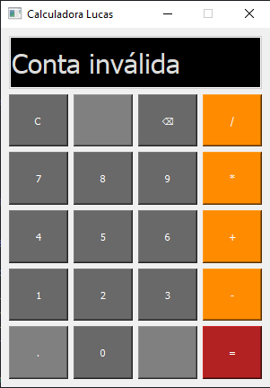

# Sobre o projeto

A calculadora é um exercício na linguaguem python que utiliza o módulo de GUI (Graphical User Interface) PyQt

Projeto Criado como exercício do curso na Udemy "Curso de Python 3 do Básico Ao Avançado" do professor Luiz Otávio Miranda.

        


# Como executar o projeto

Pré-requisitos: Python 3.9, Pyqt5
```bash
# clonar repositório
$ git clone https://github.com/lucaslarry/Calculadora-com-GUI
```
Depois é só rodar o arquivo main.py com:
```bash
# executar o projeto
$ python main.py
```
# Tecnologias utilizadas
- Python

